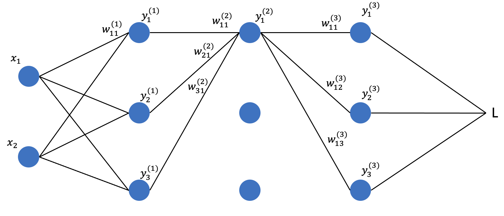

# Deep Learning Framework Exploration-基础ch1

## 正向传播

如图：

假设一个简单 3 层全连接网络结构，输入用 $ x $ 表示，上标 $ (l) $ 表示第 $ l $ 层神经元，每一层的输出用符号 $ y $ 表示，权重用符号 $ w $ 表示，部分连接线路没有画出来。暂时忽略偏置和激活函数。

第一层的参数表示如下：
$$
\begin{bmatrix}
w_{11}^{(1)} & w_{12}^{(1)} & w_{13}^{(1)} \\
w_{21}^{(1)} & w_{22}^{(1)} & w_{23}^{(1)} \\
\end{bmatrix}
$$
第一层神经元的值为：
$$
\begin{bmatrix}
y_{1}^{(1)} & y_{2}^{(1)} & y_{3}^{(1)}
\end{bmatrix}
=
\begin{bmatrix}
x_1 & x_2
\end{bmatrix}
\times
\begin{bmatrix}
w_{11}^{(1)} & w_{12}^{(1)} & w_{13}^{(1)} \\
w_{21}^{(1)} & w_{22}^{(1)} & w_{23}^{(1)} \\
\end{bmatrix}
$$
以此类推，第二层的参数和神经元值为：
$$
\begin{bmatrix}
w_{11}^{(2)} & w_{12}^{(2)} & w_{13}^{(2)} \\
w_{21}^{(2)} & w_{22}^{(2)} & w_{23}^{(2)} \\
w_{31}^{(2)} & w_{32}^{(2)} & w_{33}^{(2)} \\
\end{bmatrix}
$$

$$
\begin{bmatrix}
y_{1}^{(2)} & y_{2}^{(2)} & y_{3}^{(2)}
\end{bmatrix}
=
\begin{bmatrix}
y_{1}^{(1)} & y_{2}^{(1)} & y_{3}^{(1)}
\end{bmatrix}
\times
\begin{bmatrix}
w_{11}^{(2)} & w_{12}^{(2)} & w_{13}^{(2)} \\
w_{21}^{(2)} & w_{22}^{(2)} & w_{23}^{(2)} \\
w_{31}^{(2)} & w_{32}^{(2)} & w_{33}^{(2)} \\
\end{bmatrix}
$$

第三层的参数和神经元为：
$$
\begin{bmatrix}
w_{11}^{(3)} & w_{12}^{(3)} & w_{13}^{(3)} \\
w_{21}^{(3)} & w_{22}^{(3)} & w_{23}^{(3)} \\
w_{31}^{(3)} & w_{32}^{(3)} & w_{33}^{(3)} \\
\end{bmatrix}
$$

$$
\begin{bmatrix}
y_{1}^{(3)} & y_{2}^{(3)} & y_{3}^{(3)}
\end{bmatrix}
=
\begin{bmatrix}
y_{1}^{(2)} & y_{2}^{(2)} & y_{3}^{(2)}
\end{bmatrix}
\times
\begin{bmatrix}
w_{11}^{(3)} & w_{12}^{(3)} & w_{13}^{(3)} \\
w_{21}^{(3)} & w_{22}^{(3)} & w_{23}^{(3)} \\
w_{31}^{(3)} & w_{32}^{(3)} & w_{33}^{(3)} \\
\end{bmatrix}
$$

第三层为最后一层，进入 $loss$ 函数进行运算：
$$
L = f(y_{1}^{(3)}, y_{2}^{(3)}, y_{3}^{(3)})
$$

上述过程就是整个正向传播的过程用矩阵运算的表示结果。

由梯度下降的公式得：
$$
w = w -\alpha \frac{\partial L}{\partial w}
$$
需要对每一个权重计算 ${\partial L}/{\partial w}$。可以先看公式推导，首先计算第三层（最后一层的梯度）：
$$
\frac{\partial L}{\partial w_{11}^{(3)}} = \frac{\partial L}{\partial y_{1}^{(3)}} \cdot \frac{\partial y_{1}^{(3)}}{\partial w_{11}^{(3)}} = \frac{\partial L}{\partial y_{1}^{(3)}} \cdot y_{1}^{(2)}
$$
同理得到其他第三层的梯度：
$$
\frac{\partial L}{\partial w_{12}^{(3)}} = \frac{\partial L}{\partial y_{2}^{(3)}} \cdot y_{1}^{(2)}
$$

$$
\frac{\partial L}{\partial w_{13}^{(3)}} = \frac{\partial L}{\partial y_{3}^{(3)}} \cdot y_{1}^{(2)}
$$

$$
\frac{\partial L}{\partial w_{21}^{(3)}} = \frac{\partial L}{\partial y_{1}^{(3)}} \cdot y_{2}^{(2)}
$$

以次类推，得到第三层所有权重的梯度值，假设我们用符号 $g_{ii}^{(l)}$ 表示 $l$ 层的权重们的梯度值
$$
\begin{bmatrix}
g_{11}^{(3)} & g_{12}^{(3)} & g_{13}^{(3)} \\
g_{21}^{(3)} & g_{22}^{(3)} & g_{23}^{(3)} \\
g_{31}^{(3)} & g_{32}^{(3)} & g_{33}^{(3)} \\
\end{bmatrix}
=
\begin{bmatrix}
\frac{\partial L}{\partial y_{1}^{(3)}} \cdot y_{1}^{(2)} &  \frac{\partial L}{\partial y_{2}^{(3)}} \cdot y_{1}^{(2)} & \frac{\partial L}{\partial y_{3}^{(3)}} \cdot y_{1}^{(2)} \\
\frac{\partial L}{\partial y_{1}^{(3)}} \cdot y_{2}^{(2)} & \frac{\partial L}{\partial y_{2}^{(3)}} \cdot y_{2}^{(2)} & \frac{\partial L}{\partial y_{2}^{(3)}} \cdot y_{2}^{(2)} \\
\frac{\partial L}{\partial y_{1}^{(3)}} \cdot y_{3}^{(2)} & \frac{\partial L}{\partial y_{2}^{(3)}} \cdot y_{3}^{(2)} & \frac{\partial L}{\partial y_{3}^{(3)}} \cdot y_{3}^{(2)} \\
\end{bmatrix}
$$
化简表达式：
$$
\begin{bmatrix}
g_{11}^{(3)} & g_{12}^{(3)} & g_{13}^{(3)} \\
g_{21}^{(3)} & g_{22}^{(3)} & g_{23}^{(3)} \\
g_{31}^{(3)} & g_{32}^{(3)} & g_{33}^{(3)} \\
\end{bmatrix}
=
\begin{bmatrix}
y_{1}^{(2)} \\
y_{2}^{(2)} \\
y_{3}^{(2)}
\end{bmatrix}
\times
\begin{bmatrix}
\frac{\partial L}{\partial y_{1}^{(3)}} &
\frac{\partial L}{\partial y_{2}^{(3)}} &
\frac{\partial L}{\partial y_{3}^{(3)}}
\end{bmatrix}
$$

同理计算第二层的梯度：
$$
\begin{bmatrix}
g_{11}^{(2)} & g_{12}^{(2)} & g_{13}^{(2)} \\
g_{21}^{(2)} & g_{22}^{(2)} & g_{23}^{(2)} \\
g_{31}^{(2)} & g_{32}^{(2)} & g_{33}^{(2)} \\
\end{bmatrix}
=
\begin{bmatrix}
y_{1}^{(1)} \\
y_{2}^{(1)} \\
y_{3}^{(1)}
\end{bmatrix}
\times
\begin{bmatrix}
\frac{\partial L}{\partial y_{1}^{(2)}} &
\frac{\partial L}{\partial y_{2}^{(2)}} &
\frac{\partial L}{\partial y_{3}^{(2)}}
\end{bmatrix}
$$
上式中，$\partial L / \partial y_1^{(2)}$、$\partial L / \partial y_2^{(2)}$、$\partial L / \partial y_3^{(2)}$ 明显需要计算，我们进一步写出其表达式，例如：
$$
\frac{\partial L}{\partial y_{1}^{(2)}} = \frac{\partial L}{\partial y_1^{(3)}} \cdot w_{11}^{(3)} + \frac{\partial L}{\partial y_2^{(3)}} \cdot w_{12}^{(3)} + \frac{\partial L}{\partial y_3^{(3)}} \cdot w_{13}^{(3)}
$$
显然，第二层梯度需要计算的 $\frac{\partial L}{\partial y_1^{(3)}}$，$\frac{\partial L}{\partial y_2^{(3)}}$，$\frac{\partial L}{\partial y_3^{(3)}}$ 在第三层的计算梯度的时候已经计算过了，

